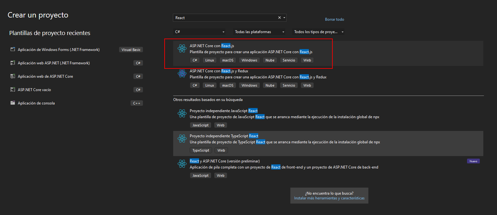
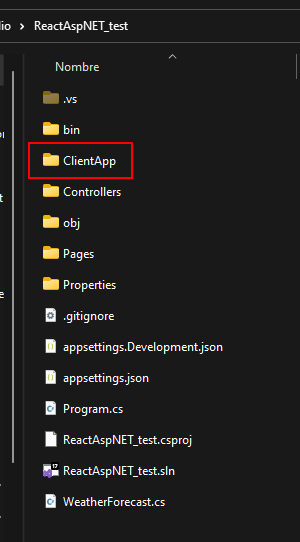

# ASP.NET Core + ReactJS 

Utiizando la plantilla con React y Asp.NET que aparece desde visual studio



> Utiliza create-react-app (CRA), lo cual ya no es recomendable entonces se elimina la carpeta generada de `ClientApp`



## React con Vite

Desde el directorio del proyecto Asp:

> Se coloca el nombre de `ClientApp` y se utiliza la plantilla de React con JavaScript

```bash
    npm create vite@latest
```

## Configuración

### .csproj

Desde el archivo de la configuración del proyecto de ASP se coloca:

1. La dirección del frontend 
2. El comando `npm run dev` correspondiente a la ejecución con Vite
3. La carpeta al construir el proyecto frontend es en `dist\`

```js
    <SpaProxyServerUrl>http://localhost:5173</SpaProxyServerUrl>
    <SpaProxyLaunchCommand>npm run dev</SpaProxyLaunchCommand>
    <DistFiles Include="$(SpaRoot)dist\**" />
```

### Properties/launchSettings.json

Desde el proyecto de ASP se busca el `Profiles` y la aplicación de backend con https

```json
 "profiles": {
    "ReactAspNET_test": {
      "applicationUrl": "https://localhost:7225;http://localhost:5152",
      }
    },
```


### Vite.config

Desde el proyecto frontend se accede a la configuración de Vite y se apunta al backend con la dirección base de `/api`

```js
import { defineConfig } from 'vite'
import react from '@vitejs/plugin-react'

// https://vitejs.dev/config/
export default defineConfig({
  plugins: [react()],
  server: {
    proxy: {
      '/api':{
        target: 'https://localhost:7225'
      }
    }
  }
})

```

### Controllers

Por último cada controlador debe tener la ruta con `api/`

```cs
namespace ReactAspNET_test.Controllers
{
    [ApiController]
    [Route("api/[controller]")]
}
```